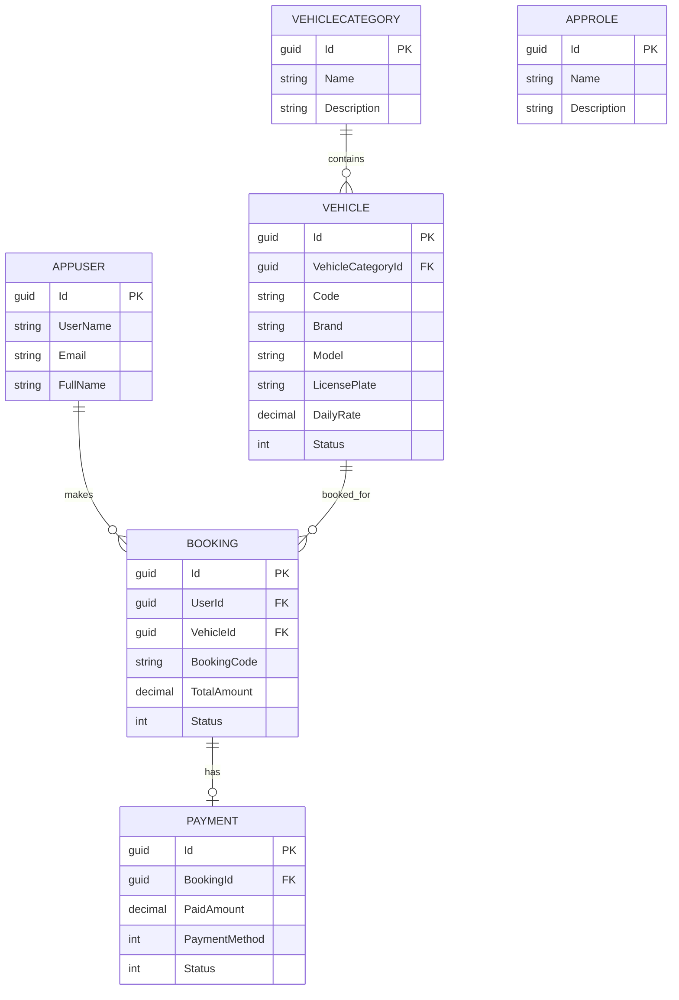

# Vehicle-Booking-System

Hệ thống Quản lý và Đặt xe trực tuyến (Vehicle Booking Management System).

## Kiến trúc

Project được dựng bằng ASP.NET Core MVC + Entity Framework Core Code First + SQL Server. `Users` và `Roles` dùng ASP.NET Core Identity, còn `Vehicles`, `Bookings`, `Payments` và `VehicleCategories` là các bảng nghiệp vụ. Cấu hình hiện tại trỏ vào SQL Server Express theo datasource bạn cung cấp và database `QuanLyDatXeNew`.
Trong môi trường production, migrate/seed khi khởi động đã được tách thành cấu hình riêng, mặc định tắt.

## ERD



## Chạy ứng dụng

```bash
dotnet restore
dotnet ef database update
dotnet run --project VehicleBookingSystem
```

Connection string cho môi trường development nằm trong `VehicleBookingSystem/appsettings.Development.json`. Nếu triển khai production, hãy đặt `ConnectionStrings__DefaultConnection` và giữ `StartupOptions:ApplyMigrationsOnStartup`/`StartupOptions:SeedOnStartup` ở `false`.

## Seed dữ liệu mẫu

- Tài khoản admin: `admin@vehiclebooking.local`
- Mật khẩu admin: đặt qua .NET User Secrets (không commit vào source control) khi bật `StartupOptions:SeedOnStartup`

  ```bash
  dotnet user-secrets set "SeedData:AdminPassword" "<your-secure-password>" --project VehicleBookingSystem
  ```

- Role: `Admin`, `Customer`
- Danh mục xe: `Sedan`, `SUV`, `MPV`, `Hatchback`
- Xe mẫu đã được tạo sẵn khi ứng dụng khởi động lần đầu
