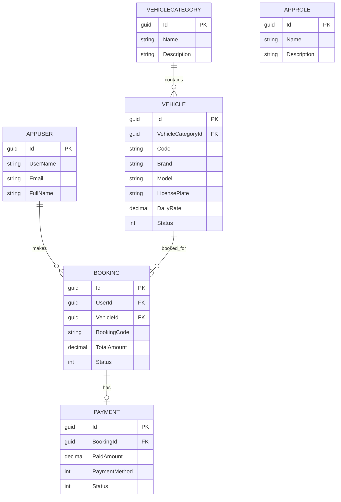

# Vehicle-Booking-System

Hệ thống Quản lý và Đặt xe trực tuyến (Vehicle Booking Management System).

## Kiến trúc

Project được dựng bằng ASP.NET Core MVC + Entity Framework Core Code First + SQL Server. `Users` và `Roles` dùng ASP.NET Core Identity, còn `Vehicles`, `Bookings`, `Payments` và `VehicleCategories` là các bảng nghiệp vụ. Phần nghiệp vụ chính đã được tách vào service layer riêng: `AccountService`, `BookingService`, `CustomerService`, `VehicleService`.

Ứng dụng đã được chỉnh để mở ổn trong Visual Studio 2022/2025 bằng launch profile trong `VehicleBookingSystem/Properties/launchSettings.json`. Ảnh gallery và avatar không còn phụ thuộc vào working directory hiện tại, nên chạy từ Visual Studio, `dotnet run`, hay IIS Express đều ổn định hơn.

API đã chuẩn hóa response theo `ApiResponse<T>` cho dữ liệu thành công và dùng `ProblemDetails` chung cho lỗi.

## ERD



## Chạy ứng dụng

```bash
dotnet restore
dotnet ef database update
dotnet run --project VehicleBookingSystem
```

Connection string cho môi trường development nằm trong `VehicleBookingSystem/appsettings.Development.json`. Nếu triển khai production, hãy đặt `ConnectionStrings__DefaultConnection`, `Jwt__Key`, và các biến cấu hình khác qua environment variables hoặc secret store của hạ tầng.

JWT signing key không còn nằm trực tiếp trong source. Ở Development, app sẽ tự sinh key tạm để demo chạy ổn định; ở môi trường khác, bạn phải cấu hình `Jwt__Key` qua user-secrets hoặc môi trường.

Hai cờ `StartupOptions:ApplyMigrationsOnStartup` và `StartupOptions:SeedOnStartup` mặc định tắt để app khởi động ổn định. Nếu cần seed dữ liệu demo, hãy bật lại thủ công và đặt `SeedData:AdminPassword` bằng user-secrets.

## Frontend UI Smoke Tests (Playwright)

Project test đã có các smoke tests cho 3 luồng critical:
- Listing filter
- Booking create (anonymous flow redirect login)
- Admin dashboard chart render

Các test UI đã được gắn category riêng: `Category=E2E`.

### Lệnh pipeline mặc định (nhanh, không chạy E2E)

```bash
dotnet test VehicleBookingSystem.Tests/VehicleBookingSystem.Tests.csproj --filter "Category!=E2E"
```

### Lệnh chạy riêng E2E smoke tests

```bash
dotnet test VehicleBookingSystem.Tests/VehicleBookingSystem.Tests.csproj --filter "Category=E2E"
```

Các test này chỉ chạy khi bật cờ môi trường, để tránh fail trên máy chưa chạy web app:

```bash
set RUN_UI_SMOKE=true
set UI_BASE_URL=https://localhost:5001
set UI_ADMIN_EMAIL=admin@vehiclebooking.local
set UI_ADMIN_PASSWORD=<your-admin-password>
dotnet test VehicleBookingSystem.Tests/VehicleBookingSystem.Tests.csproj
```

Lần đầu chạy cần cài browser cho Playwright:

```bash
pwsh VehicleBookingSystem.Tests/bin/Debug/net9.0/playwright.ps1 install
```

## Seed dữ liệu mẫu

- Tài khoản admin: `admin@vehiclebooking.local`
- Mật khẩu admin: đặt qua .NET User Secrets (không commit vào source control) khi bật `StartupOptions:SeedOnStartup`

  ```bash
  dotnet user-secrets set "SeedData:AdminPassword" "<your-secure-password>" --project VehicleBookingSystem
  ```

- Role: `Admin`, `Customer`
- Danh mục xe: `Sedan`, `SUV`, `MPV`, `Hatchback`
- Xe mẫu đã được tạo sẵn khi ứng dụng khởi động lần đầu

## Kiến trúc hiện tại

- MVC controllers chỉ còn vai trò orchestration.
- Service layer xử lý query/command cho account, booking, customer và vehicle.
- API bookings dùng `ApiResponse<T>` và `ApiProblemDetailsFactory` để giữ response nhất quán.
- Các lỗi runtime đi qua `HomeController.Error` để hiển thị HTML cho MVC hoặc ProblemDetails cho API.

## Tài liệu nộp bài

Các file Markdown phục vụ báo cáo và đóng gói được đặt trong thư mục `docs/`:

- [Báo cáo tổng kết](docs/bao-cao-tong-ket.md)
- [Hướng dẫn cài đặt và cấu hình](docs/huong-dan-cai-dat-va-cau-hinh.md)
- [Hướng dẫn đóng gói sản phẩm](docs/dong-goi-san-pham.md)

Khi hoàn thiện, hãy xuất báo cáo sang Word/PDF theo đúng định dạng yêu cầu của giảng viên và thêm ảnh minh họa thực tế vào các vị trí được đánh dấu trong báo cáo.
