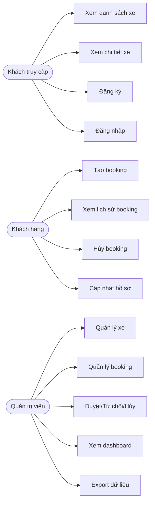
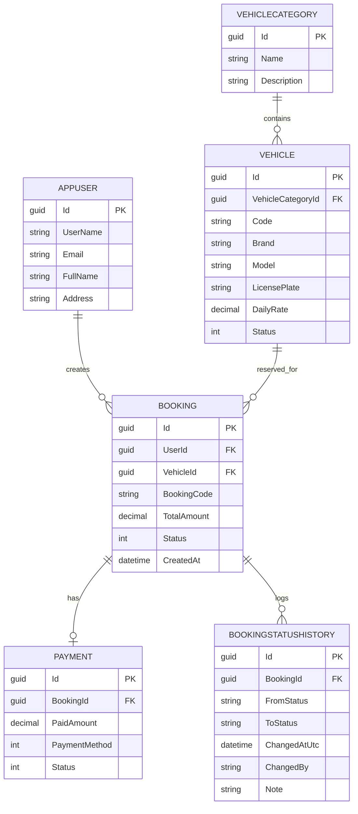
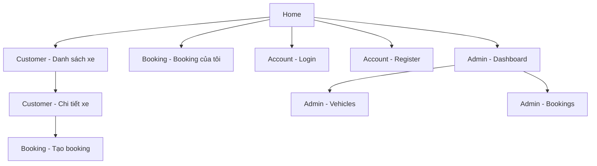

# BÁO CÁO TỔNG KẾT ĐỒ ÁN

## Trang bìa

- **Tên trường:** [Điền tên trường]
- **Tên môn học:** Lập trình Web / ASP.NET MVC Core
- **Tên đề tài:** Vehicle Booking System - Hệ thống quản lý và đặt xe trực tuyến
- **Tên nhóm thực hiện:** [Điền tên nhóm]
- **Lớp:** [Điền lớp]
- **Giảng viên hướng dẫn:** [Điền tên giảng viên]
- **Năm thực hiện:** 2026

> Ghi chú trình bày khi xuất Word/PDF: Times New Roman 13, giãn dòng 1.1, lề trên 2cm, lề dưới 2cm, lề trái 1.5cm, lề phải 1.5cm, gáy 2cm, không có header/footer.

---

## Mục lục

1. Tổng quan về đề tài
2. Phân tích và thiết kế
3. Thiết kế hệ thống
4. Kiểm thử
5. Kết luận, phân công, tài liệu tham khảo
6. Kết quả đạt được so với mục tiêu, bài học và hướng phát triển

---

## 1. Tổng Quan Về Đề Tài

### 1.1 Mô tả hệ thống

Vehicle Booking System là hệ thống web hỗ trợ quản lý xe và quy trình đặt xe trực tuyến. Hệ thống phục vụ hai nhóm người dùng chính:

- **Khách hàng**: tra cứu xe, xem chi tiết, tạo booking, xem lịch sử đặt xe, hủy booking theo điều kiện cho phép.
- **Quản trị viên**: quản lý danh mục xe, xe, booking, duyệt/từ chối/hủy booking, xem báo cáo tổng quan.

Hệ thống được xây dựng bằng ASP.NET Core MVC, Entity Framework Core Code First, SQL Server, Bootstrap 5, jQuery và DataTables.

### 1.2 Nghiệp vụ cơ bản

Các nghiệp vụ chính gồm:

- Đăng ký, đăng nhập, phân quyền theo vai trò.
- Quản lý danh mục xe, xe, ảnh xe.
- Tra cứu xe theo tìm kiếm, lọc, phân trang.
- Đặt xe theo thời gian, tính tiền dự kiến.
- Quản trị booking: duyệt, từ chối, hủy, xem lịch sử trạng thái.
- Quản lý hồ sơ tài khoản, ngôn ngữ giao diện, session, cookie.

### 1.3 Khảo sát và biểu mẫu thu thập

Trong quá trình phân tích, nhóm ghi nhận các nhu cầu sau:

- Người dùng cần giao diện rõ ràng, tương thích điện thoại.
- Quản trị cần bảng dữ liệu có lọc, tìm kiếm, phân trang nhanh.
- Nội dung mô tả xe cần hỗ trợ rich text.
- Cần upload và xem trước ảnh.
- Cần hỗ trợ tiếng Việt và tiếng Anh.
- Cần có tài liệu cài đặt, cấu hình và script dựng CSDL.

### 1.4 Phân tích yêu cầu theo lớp người dùng

#### 1.4.1 Khách hàng

- Xem danh sách xe.
- Tìm xe, lọc theo tiêu chí.
- Xem chi tiết xe.
- Tạo booking.
- Xem lịch sử booking của cá nhân.
- Hủy booking trong điều kiện cho phép.

#### 1.4.2 Quản trị viên

- Quản lý xe và danh mục xe.
- Duyệt/từ chối/hủy booking.
- Xem dashboard.
- Xem booking theo bộ lọc, chi tiết, lịch sử trạng thái.
- Thực hiện bulk actions, xuất dữ liệu.

---

## 2. Phân Tích Và Thiết Kế

### 2.1 Use-case diagram

### 2.2 Thiết kế cơ sở dữ liệu

Hệ thống sử dụng mô hình Code First với các bảng chính:

- `AspNetUsers`, `AspNetRoles`, `AspNetUserRoles`, ...: xác thực và phân quyền.
- `VehicleCategories`: danh mục xe.
- `Vehicles`: thông tin xe.
- `Bookings`: thông tin booking.
- `Payments`: thông tin thanh toán.
- `BookingStatusHistories`: lịch sử thay đổi trạng thái booking.

#### 2.2.1 ERD

### 2.3 Ràng buộc dữ liệu

Các ràng buộc quan trọng:

- `Vehicle.Code` và `Vehicle.LicensePlate` là duy nhất.
- `Booking.BookingCode` là duy nhất.
- `Booking.RowVersion` dùng cho chống ghi đè dữ liệu.
- `Payment.BookingId` là one-to-one.
- `BookingStatusHistory.BookingId` là one-to-many.
- Các trường bắt buộc được kiểm soát bằng Annotation và FluentValidation.

### 2.4 Sitemap

### 2.5 Wireframe

Do báo cáo nộp bằng file Markdown, wireframe nên được chèn hình từ draw.io hoặc astah vào thư mục `docs/images/` sau khi export. Các màn hình nên có tối thiểu:

- Trang danh sách xe cho khách.
- Trang chi tiết xe.
- Form tạo booking.
- Dashboard Admin.
- Danh sách xe Admin.
- Danh sách booking Admin.

---

## 3. Thiết Kế Hệ Thống

### 3.1 Kiến trúc tổng thể

Hệ thống được tổ chức theo các tầng chính:

- **Presentation layer**: Razor Views, Bootstrap, jQuery, DataTables.
- **Application layer**: Controllers, validation, view models, API contracts.
- **Domain/Data layer**: Entities, DbContext, migrations, seed data.
- **Infrastructure layer**: file storage, sanitizer, session extension.

### 3.2 Chức năng đã xây dựng

#### 3.2.1 Phía khách hàng

- Đăng ký / đăng nhập / đăng xuất.
- Xem danh sách xe.
- Tìm kiếm và lọc xe.
- Xem chi tiết xe.
- Đặt xe.
- Xem booking cá nhân.
- Hủy booking.

#### 3.2.2 Phía quản trị

- Dashboard tổng quan.
- CRUD xe.
- CRUD danh mục xe.
- Quản lý booking.
- Xem lịch sử trạng thái booking.
- Phân quyền theo Admin.

### 3.3 Giao diện và công nghệ front-end

Các công nghệ front-end sử dụng:

- Bootstrap 5.
- jQuery.
- DataTables.
- Modal Bootstrap.
- Rich text editor cho mô tả/booking policy.
- Upload ảnh với preview.

### 3.4 Responsive

Đã tối ưu giao diện cho:

- Mobile 320px - 768px.
- Tablet 768px - 1024px.
- Desktop 1024px+.

Các điểm đã xử lý:

- Navbar và sidebar co giãn theo kích thước màn hình.
- Bảng dữ liệu đặt trong `table-responsive`.
- Nút bấm có vùng chạm tối thiểu 44px.
- Ảnh hiển thị bằng `img-fluid` / `object-fit`.
- Modal hoạt động tốt trên mobile.

### 3.5 Quốc tế hóa

Hệ thống hỗ trợ:

- Tiếng Việt mặc định.
- Tiếng Anh.
- Chuyển ngôn ngữ bằng cookie.
- `CultureInfo` cho định dạng ngày giờ và tiền tệ.
- Resource files cho UI labels và validation.

### 3.6 Bảo mật

Các điểm bảo mật chính:

- Phân quyền bằng Identity role.
- API Admin yêu cầu role `Admin`.
- Dữ liệu input được kiểm soát bằng annotation và validator.
- Nội dung HTML mô tả được sanitize.
- Upload ảnh giới hạn định dạng và dung lượng.
- Session và cookie được cấu hình HttpOnly/SameSite/Secure.
- Chống ghi đè dữ liệu bằng `RowVersion`.

### 3.7 RESTful API

Hệ thống có các API chính:

- `GET /api/vehicles`
- `GET /api/vehicles/{id}`
- `GET /api/vehicles/{id}/availability`
- `POST /api/vehicles`
- `PUT /api/vehicles/{id}`
- `DELETE /api/vehicles/{id}`
- `GET /api/bookings`
- `GET /api/bookings/{id}`
- `POST /api/bookings`
- `PUT /api/bookings/{id}/cancel`
- `POST /api/auth/token`

### 3.8 Ảnh minh họa kết quả

Khi hoàn thiện file nộp, nên thêm ảnh chụp màn hình vào thư mục `docs/images/` và chèn vào các mục:

- Danh sách xe.
- Form tạo/sửa xe.
- Danh sách booking Admin.
- Modal chi tiết booking.
- Màn hình đổi ngôn ngữ.
- Trang responsive mobile.

---

## 4. Kiểm Thử

### 4.1 Mục tiêu

- Phát hiện lỗi chức năng trước khi nộp.
- Kiểm tra luồng chính của khách hàng và Admin.
- Xác nhận responsive, localization và REST API hoạt động đúng.

### 4.2 Cách thức

Nhóm kiểm thử theo các nhóm:

- Test thủ công trên trình duyệt.
- Test tự động bằng xUnit.
- Smoke test UI cho luồng critical.
- Kiểm tra build / test trước khi đóng gói.

### 4.3 Danh mục test case

| ID | Mục tiêu test | Dữ liệu đầu vào | Đầu ra dự kiến | Đầu ra thực tế | Kết quả |
|---|---|---|---|---|---|
| TC-01 | Tạo booking hợp lệ | Xe khả dụng, thời gian hợp lệ | Booking tạo thành công | Booking tạo thành công | Pass |
| TC-02 | Đặt booking sai thời gian | ReturnDate <= PickupDate | Validation báo lỗi | Validation báo lỗi | Pass |
| TC-03 | Admin duyệt booking | Booking pending | Status chuyển Confirmed | Status chuyển Confirmed | Pass |
| TC-04 | Admin từ chối booking | Booking pending | Status chuyển Rejected | Status chuyển Rejected | Pass |
| TC-05 | Hủy booking khách | Booking còn hạn hủy | Status chuyển Cancelled | Status chuyển Cancelled | Pass |
| TC-06 | Lọc danh sách xe | Search/filter/category | DataTable lọc đúng | DataTable lọc đúng | Pass |
| TC-07 | Đổi ngôn ngữ | Chọn vi/en | UI đổi locale | UI đổi locale | Pass |
| TC-08 | Responsive mobile | Màn hình 320px | Không vỡ layout | Không vỡ layout | Pass |

### 4.4 Kết quả kiểm thử

Kết quả hiện tại sau khi build/test:

- `dotnet build` thành công.
- `dotnet test` thành công.
- Test validation culture-dependent đã được cập nhật để ổn định theo `vi-VN`.

### 4.5 Ghi chú xử lý lỗi

Trong quá trình hoàn thiện, đã gặp lỗi test validation phụ thuộc ngôn ngữ mặc định. Cách fix:

- Chuyển custom validation attribute sang trả message tại thời điểm validate.
- Cập nhật test để set `CurrentCulture` / `CurrentUICulture` rõ ràng.
- Chạy lại build/test để xác nhận pass.

---

## 5. Kết Luận, Phân Công, Tài Liệu Tham Khảo

### 5.1 Kết luận

Hệ thống Vehicle Booking System đã đáp ứng các yêu cầu chức năng chính của bài tập lớn:

- Có ít nhất hai lớp người dùng với quyền và chức năng khác nhau.
- Có CRUD, paging, filtering, AJAX.
- Có session, cookies.
- Có validation và annotation.
- Có RESTful API.
- Có upload ảnh và rich text editor.
- Có responsive.
- Có localization.
- Có kiểm thử.

### 5.2 Bảng phân công công việc nhóm

| Thành viên | Công việc |
|---|---|
| [Tên 1] | Phân tích yêu cầu, thiết kế CSDL |
| [Tên 2] | Xây dựng UI khách hàng |
| [Tên 3] | Xây dựng Admin, DataTables, AJAX |
| [Tên 4] | API, validation, localization |
| [Tên 5] | Kiểm thử, tài liệu, đóng gói |

### 5.3 Tài liệu tham khảo

- Microsoft Learn - ASP.NET Core MVC.
- Microsoft Learn - Entity Framework Core.
- Bootstrap 5 Documentation.
- jQuery Documentation.
- DataTables Documentation.
- SQL Server Documentation.

---

## 6. Kết Quả Đạt Được So Với Mục Tiêu, Bài Học Và Hướng Phát Triển

### 6.1 So sánh với mục tiêu

- Mục tiêu xây dựng hệ thống web thực tiễn: đạt.
- Mục tiêu vận dụng quy trình phát triển phần mềm: đạt.
- Mục tiêu làm việc nhóm và tài liệu: đạt ở mức có thể nộp.
- Mục tiêu kỹ thuật MVC + database + API + responsive: đạt.

### 6.2 Bài học rút ra

- Thiết kế CSDL nên đi cùng nhu cầu nghiệp vụ thực tế.
- Validation cần tách rõ message theo locale.
- DataTables/AJAX giúp cải thiện trải nghiệm Admin rõ rệt.
- Khi có nhiều lớp người dùng, cần phân quyền ngay từ đầu.

### 6.3 Hướng phát triển

- Thêm dashboard báo cáo nâng cao.
- Thêm audit log đầy đủ hơn cho mọi thay đổi trạng thái.
- Thêm export Excel/PDF chuẩn hơn.
- Thêm notification cho booking status.
- Thêm CI/CD và container deployment.

---

## Phụ lục: Danh sách ảnh đề xuất chèn vào báo cáo

- `docs/images/erd.png`
- `docs/images/usecase.png`
- `docs/images/sitemap.png`
- `docs/images/wireframe-home.png`
- `docs/images/wireframe-admin-vehicle.png`
- `docs/images/wireframe-admin-booking.png`
- `docs/images/ui-mobile.png`
- `docs/images/ui-booking-modal.png`

---

## Ghi chú xuất bản

Khi nộp chính thức, nên:

1. Chuyển file Markdown sang Word hoặc PDF.
2. Căn chỉnh đúng format yêu cầu của giảng viên.
3. Chèn ảnh thực tế của hệ thống sau khi chạy.
4. Bổ sung tên trường, tên nhóm, lớp, giảng viên, năm thực hiện.
5. Kiểm tra chính tả và thống nhất thuật ngữ trước khi in.
